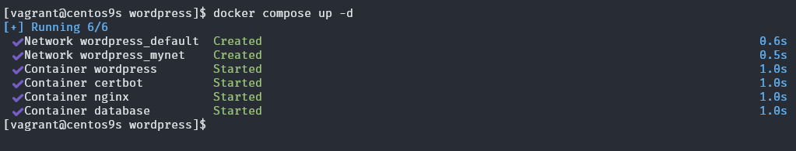
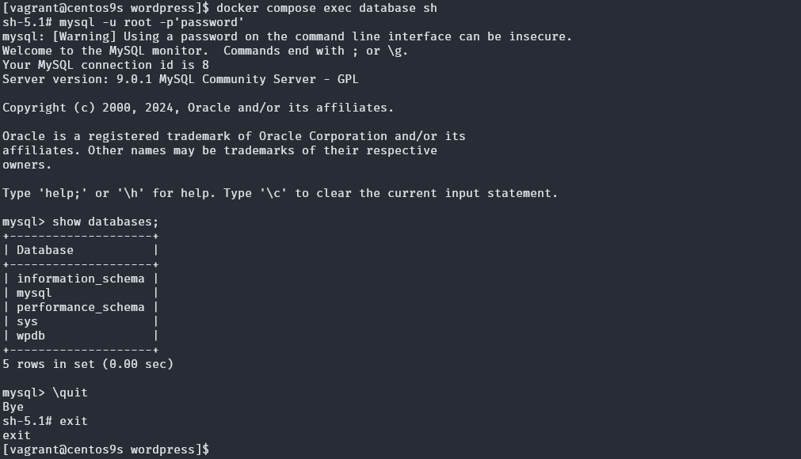

# Deploy Wordpress with Docker

## Let Verify docker engine host   (install docker engine from chapter 6)

```
[vagrant@centos9s ~]$ docker --version
[vagrant@centos9s ~]$ docker compose --version
```


## Step 1 Create project directory
- Create wordpress folder project
```
$ mkdir wordpress
$ mkdir wordpress/nginx
$ cd wordpress
```
- create 2 File 
    - docker-compose.yml
    - nginx.conf
```
$ tree wordpress/
wordpress/
├── docker-compose.yml
└── nginx
    └── nginx.conf
```

## Step 2 Define Docker compose
- create docker compose file
```
$ vim docker-compose.yml
```

```
services:
  database:
    image: mysql:latest
    container_name: database
    networks:
      - mynet
    volumes:
      - mydb:/var/lib/mysql/
    environment:
      - MYSQL_ROOT_PASSWORD=password
      - MYSQL_DATABASE=wpdb
      - MYSQL_USER=user
      - MYSQL_PASSWORD=password

  wordpress:
    image: wordpress:6.6.1-php8.1-fpm-alpine
    container_name: wordpress
    networks:
      - mynet
    volumes:
      - mywp:/var/www/html/
    environment:
      - WORDPRESS_DB_HOST=database
      - WORDPRESS_DB_USER=user
      - WORDPRESS_DB_PASSWORD=password
      - WORDPRESS_DB_NAME=wpdb

  nginx:
    image: nginx:latest
    ports:
      - "80:80"
    container_name: nginx
    networks:
      - mynet
    volumes:
      - ./nginx:/etc/nginx/conf.d/
      - mywp:/var/www/html/
      - certbot-etc:/etc/letsencrypt

  certbot:
    image: certbot/certbot
    container_name: certbot
    volumes:
      - certbot-etc:/etc/letsencrypt
      - mywp:/var/www/html/
    command: certonly --webroot --webroot-path=/var/www/html --email sawangpongm@gmail.com --agree-tos --no-eff-email --staging -d demodomain.com -d www.demodomain.com

networks:
  mynet:

volumes:
  mywp:
  mydb:
  certbot-etc:

```
- **create nginx configuration**
```
vim nginx.conf
```

```
server {
    listen 80;
    server_name www.demodomain.com demodomain.com;


    root /var/www/html;
    index index.php;


    # log files
    access_log /var/log/nginx/demodomain.com.access.log;
    error_log /var/log/nginx/demodomain.com.error.log;

    location = /favicon.ico {
        log_not_found off;
        access_log off;
    }

    location = /robots.txt {
        allow all;
        log_not_found off;
        access_log off;
    }

    location / {
        try_files $uri $uri/ /index.php?$args;
    }

    location ~ \.php$ {
        try_files $uri =404;
            fastcgi_pass wordpress:9000;
        fastcgi_index   index.php;
        fastcgi_param SCRIPT_FILENAME $document_root$fastcgi_script_name;
        include fastcgi_params;
    }

    location ~* \.(js|css|png|jpg|jpeg|gif|ico|svg)$ {
        expires max;
        log_not_found off;
    }

}
```

- **Run Docker compose up** ตามด้วย option -d
```
[vagrant@centos9s wordpress]$ docker compose up -d
```
output:


- use ```docker compose up``` compare with ```docker ps```
```
[vagrant@centos9s ~]$ docker ps

[vagrant@centos9s ~]$ docker compose ps
```
output:


- log monitor ด้วยคำสั่ง ```docker compose logs service_name```
```
[vagrant@centos9s ~]$ docker compose logs database
[vagrant@centos9s ~]$ docker compose logs nginx
[vagrant@centos9s ~]$ docker compose logs wordpress
```

- Exec shell in database Container
```
[vagrant@centos9s ~]$ docker compose exec database sh

```
output:


- List Volume
```
[vagrant@centos9s ~]$ docker volume ls
...
local     wordpress_certbot-etc
local     wordpress_mydb
local     wordpress_mywp
```
> format name of volume   "projectfolder_servicename"

- List Network

```
[vagrant@centos9s wordpress]$ docker network ls
NETWORK ID     NAME                DRIVER    SCOPE
3cb46e381eca   bridge              bridge    local
65eb29bf910d   host                host      local
...
863fe8638234   wordpress_default   bridge    local
a675fbecf8a8   wordpress_mynet     bridge    local
```

- Open Browser    http://demodomain.com/, http://www.demodomain.com/
 


- Exec to nginx controller
```
[vagrant@centos9s wordpress]$ docker compose exec nginx bash
root@57db1db01aad:/# cd /var/www/html/
```
- Renew Certificate
```
[vagrant@centos9s wordpress]$ docker compose up --force-recreate --no-deps certbot
```

## Full implementation by USE https 
- add port mapping  in docker-compose.yml
  ```
      ports: 
      - "80:80"
      - "443:443"
  ```
- Final docker-compose.yml
```
services:
  database:
    image: mysql:latest
    container_name: database
    networks:
      - mynet
    volumes:
      - mydb:/var/lib/mysql/
    environment:
      - MYSQL_ROOT_PASSWORD=password
      - MYSQL_DATABASE=wpdb
      - MYSQL_USER=user
      - MYSQL_PASSWORD=password

  wordpress:
    depends_on:
      - database
    image: wordpress:6.6.1-php8.1-fpm-alpine
    container_name: wordpress
    restart: unless-stopped
    networks:
      - mynet
    volumes:
      - mywp:/var/www/html/
    environment:
      - WORDPRESS_DB_HOST=database
      - WORDPRESS_DB_USER=user
      - WORDPRESS_DB_PASSWORD=password
      - WORDPRESS_DB_NAME=wpdb

  nginx:
    image: nginx:latest
    ports:
      - "80:80"
      - "443:443"
    container_name: nginx
    networks:
      - mynet
    volumes:
      - ./nginx:/etc/nginx/conf.d/
      - mywp:/var/www/html/
      - certbot-etc:/etc/letsencrypt

  certbot:
    depends_on:
      - nginx
    image: certbot/certbot
    container_name: certbot
    volumes:
      - certbot-etc:/etc/letsencrypt
      - mywp:/var/www/html/
    command: certonly --webroot --webroot-path=/var/www/html --email sawangpongm@gmail.com --agree-tos --no-eff-email --staging -d demodomain.com -d www.demodomain.com

networks:
  mynet:

volumes:
  mywp:
  mydb:
  certbot-etc:

```
- update nginx.conf
    - Backup config
```
[vagrant@centos9s wordpress]$ cd nginx/
[vagrant@centos9s nginx]$ ls
nginx.conf
[vagrant@centos9s nginx]$ mv nginx.conf nginx.conf.back
[vagrant@centos9s nginx]$ vim nginx.conf
```
- download options-ssl-nginx.conf
```
[vagrant@centos9s nginx]$ wget https://raw.githubusercontent.com/certbot/certbot/master/certbot-nginx/certbot_nginx/_internal/tls_configs/options-ssl-nginx.conf
```

    - Add new nginx.config
```
server {
        listen 80;
        listen [::]:80;

        server_name demodomain.com www.demodomain.com;

        location ~ /.well-known/acme-challenge {
                allow all;
                root /var/www/html;
        }

        location / {
                rewrite ^ https://$host$request_uri? permanent;
        }
}

server {
        listen 443 ssl http2;
        listen [::]:443 ssl http2;
        server_name demodomain.com www.demodomain.com;

        index index.php index.html index.htm;

        root /var/www/html;

        server_tokens off;

        ssl_certificate /etc/letsencrypt/live/demodomain.com/fullchain.pem;
        ssl_certificate_key /etc/letsencrypt/live/demodomain.com/privkey.pem;

        include /etc/nginx/conf.d/options-ssl-nginx.conf;

        add_header X-Frame-Options "SAMEORIGIN" always;
        add_header X-XSS-Protection "1; mode=block" always;
        add_header X-Content-Type-Options "nosniff" always;
        add_header Referrer-Policy "no-referrer-when-downgrade" always;
        add_header Content-Security-Policy "default-src * data: 'unsafe-eval' 'unsafe-inline'" always;
        # add_header Strict-Transport-Security "max-age=31536000; includeSubDomains; preload" always;
        # enable strict transport security only if you understand the implications

        location / {
                try_files $uri $uri/ /index.php$is_args$args;
        }

        location ~ \.php$ {
                try_files $uri =404;
                fastcgi_split_path_info ^(.+\.php)(/.+)$;
                fastcgi_pass wordpress:9000;
                fastcgi_index index.php;
                include fastcgi_params;
                fastcgi_param SCRIPT_FILENAME $document_root$fastcgi_script_name;
                fastcgi_param PATH_INFO $fastcgi_path_info;
        }

        location ~ /\.ht {
                deny all;
        }

        location = /favicon.ico {
                log_not_found off; access_log off;
        }
        location = /robots.txt {
                log_not_found off; access_log off; allow all;
        }
        location ~* \.(css|gif|ico|jpeg|jpg|js|png)$ {
                expires max;
                log_not_found off;
        }
}
```
- Regenrate key
```
[vagrant@centos9s wordpress]$ docker compose up --force-recreate --no-deps certbot
```


- Recreate only nginx-server
```
[vagrant@centos9s wordpress]$ docker compose up -d --force-recreate --no-deps nginx
[+] Running 1/1
 ✔ Container nginx  Started  
```

- monitor volume
Format use busybox image 
```
docker run --rm -it -v <volume_name>:/mnt busybox sh
```

```
[vagrant@centos9s wordpress]$  sudo docker run --rm -it -v wordpress_mywp:/mnt busybox sh
```
output:
