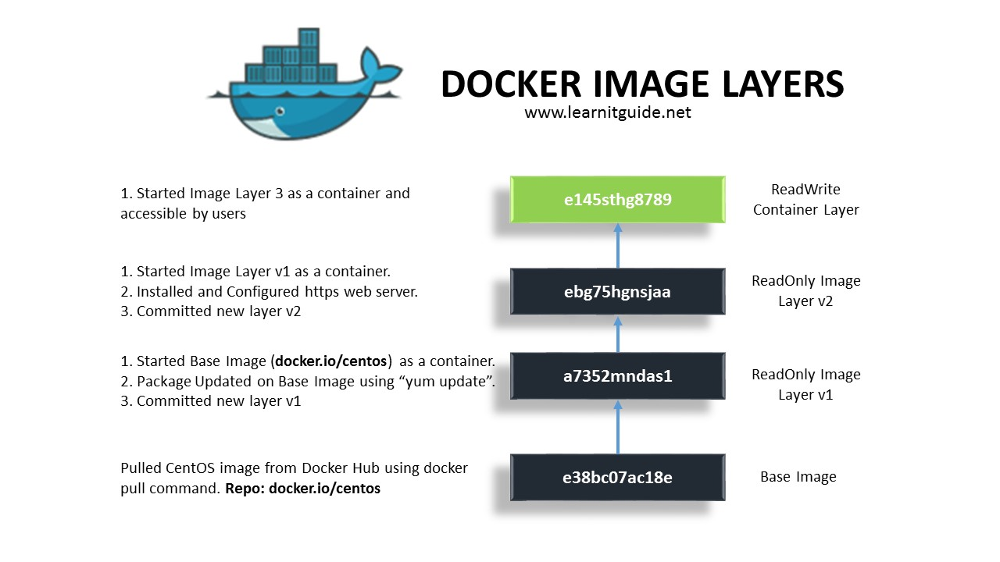
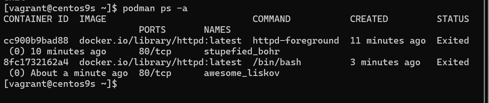

# Lab1 Installation

## Installation

```
mkdir  podman
cd podman
```
- สร้าง vagrantfile
```
# -*- mode: ruby -*-
# vi: set ft=ruby :


$script=<<-SCRIPT
    sed -i 's/PasswordAuthentication no/PasswordAuthentication yes/g' /etc/ssh/sshd_config    
    sudo systemctl restart sshd.service
    sudo firewall-cmd --state
    sudo systemctl --enable --now firewalld
    sudo firewall-cmd --add-port=80/tcp
    sudo firewall-cmd --add-port=9090/tcp
    sudo firewall-cmd --reload
    sudo firewall-cmd --get-services

SCRIPT

Vagrant.configure("2") do |config|

  config.vm.box = "generic/centos9s"

  config.vm.network "forwarded_port", guest: 80, host: 8080
  config.vm.network "forwarded_port", guest: 9090, host: 9090
  config.vm.network "private_network", ip: "192.168.33.10"
  config.vm.synced_folder ".", "/vagrant"

  config.vm.provider "virtualbox" do |vb|
     vb.memory = "4096"
     vb.cpus = 2
  end

  config.vm.provision "shell", inline: $script
end

```

- Step 1
```
[vagrant@centos9s ~]$ hostnamectl

[vagrant@centos9s ~]$ sudo dnf list podman*

Last metadata expiration check: 0:00:19 ago on Sat 17 Aug 2024 07:52:49 AM UTC.
Available Packages
podman.x86_64                       2:5.1.2-1.el9                                      appstream
podman-catatonit.x86_64             2:4.3.1-3.el9                                      appstream
podman-compose.noarch               1.0.6-3.el9                                        epel
podman-docker.noarch                2:5.1.2-1.el9                                      appstream
podman-gvproxy.x86_64               2:4.6.1-5.el9                                      appstream
podman-plugins.x86_64               2:5.1.2-1.el9                                      appstream
podman-remote.x86_64                2:5.1.2-1.el9                                      appstream
podman-tests.x86_64                 2:5.1.2-1.el9                                      appstream
podman-tui.x86_64                   1.2.0-1.el9                                        epel


```

- install docker, docker emulator (podman-docker package)

```
[vagrant@centos9s ~]$ sudo dnf install podman podman-docker
Extra Packages for Enterprise Linux 9 - x86_64          2.0 kB/s | 3.1 kB     00:01
Last metadata expiration check: 0:00:01 ago on Sat 17 Aug 2024 07:52:49 AM UTC.
Dependencies resolved.
========================================================================================
 Package                Arch       Version                          Repository     Size
========================================================================================
Installing:
 podman                 x86_64     2:5.1.2-1.el9                    appstream      16 M
 podman-docker          noarch     2:5.1.2-1.el9                    appstream     102 k
Installing dependencies:
 conmon                 x86_64     3:2.1.12-1.el9                   appstream      52 k
 container-selinux      noarch     3:2.232.1-1.el9                  appstream      56 k
 containers-common      x86_64     2:1-90.el9                       appstream     143 k
 criu                   x86_64     3.19-1.el9                       appstream     560 k
 crun                   x86_64     1.15-1.el9                       appstream     223 k
 fuse-common            x86_64     3.10.2-9.el9                     baseos        8.3 k
 fuse-overlayfs         x86_64     1.14-1.el9                       appstream      67 k
 fuse3                  x86_64     3.10.2-9.el9                     appstream      54 k
 fuse3-libs             x86_64     3.10.2-9.el9                     appstream      91 k
 libnet                 x86_64     1.2-7.el9                        appstream      58 k
 libslirp               x86_64     4.4.0-8.el9                      appstream      68 k
 netavark               x86_64     2:1.11.0-1.el9                   appstream     4.1 M
 passt                  x86_64     0^20240624.g1ee2eca-1.el9        appstream     189 k
 passt-selinux          noarch     0^20240624.g1ee2eca-1.el9        appstream      31 k
 shadow-utils-subid     x86_64     2:4.9-9.el9                      baseos         86 k
 slirp4netns            x86_64     1.3.1-1.el9                      appstream      47 k
 yajl                   x86_64     2.1.0-22.el9                     appstream      38 k
Installing weak dependencies:
 aardvark-dns           x86_64     2:1.11.0-1.el9                   appstream     985 k
 criu-libs              x86_64     3.19-1.el9                       appstream      32 k

Transaction Summary
========================================================================================
Install  21 Packages

Total download size: 23 M
Installed size: 79 M
Is this ok [y/N]: y
```

- Step3 podman version   #Check Version
```
[vagrant@centos9s ~]$ podman version
Client:       Podman Engine
Version:      5.1.2
API Version:  5.1.2
Go Version:   go1.22.4 (Red Hat 1.22.4-1.el9)
Built:        Thu Jul 11 06:11:34 2024
OS/Arch:      linux/amd64
```

- Step4 Podman info
```
[vagrant@centos9s ~]$ podman version
Client:       Podman Engine
Version:      5.1.2
API Version:  5.1.2
Go Version:   go1.22.4 (Red Hat 1.22.4-1.el9)
Built:        Thu Jul 11 06:11:34 2024
OS/Arch:      linux/amd64
[vagrant@centos9s ~]$ podman info
host:
  arch: amd64
  buildahVersion: 1.36.0
  cgroupControllers:
  - memory
  - pids
  cgroupManager: systemd
  cgroupVersion: v2
  conmon:
    package: conmon-2.1.12-1.el9.x86_64
    path: /usr/bin/conmon
    version: 'conmon version 2.1.12, commit: 7ba5bd6c81ff2c10e07aee8c4281d12a2878fa12'
  cpuUtilization:
    idlePercent: 86.81
    systemPercent: 2.48
    userPercent: 10.71
  cpus: 2
  databaseBackend: sqlite
  distribution:
    distribution: centos
    version: "9"
  eventLogger: file
  freeLocks: 2048
  hostname: centos9s.localdomain
  idMappings:
    gidmap:
    - container_id: 0
      host_id: 1000
      size: 1
    - container_id: 1
      host_id: 100000
      size: 65536
    uidmap:
    - container_id: 0
      host_id: 1000
      size: 1
    - container_id: 1
      host_id: 100000
      size: 65536
  kernel: 5.14.0-391.el9.x86_64
  linkmode: dynamic
  logDriver: k8s-file
  memFree: 2929623040
  memTotal: 3837628416
  networkBackend: netavark
  networkBackendInfo:
    backend: netavark
    dns:
      package: aardvark-dns-1.11.0-1.el9.x86_64
      path: /usr/libexec/podman/aardvark-dns
      version: aardvark-dns 1.11.0
    package: netavark-1.11.0-1.el9.x86_64
    path: /usr/libexec/podman/netavark
    version: netavark 1.11.0
  ociRuntime:
    name: crun
    package: crun-1.15-1.el9.x86_64
    path: /usr/bin/crun
    version: |-
      crun version 1.15
      commit: e6eacaf4034e84185fd8780ac9262bbf57082278
      rundir: /run/user/1000/crun
      spec: 1.0.0
      +SYSTEMD +SELINUX +APPARMOR +CAP +SECCOMP +EBPF +CRIU +YAJL
  os: linux
  pasta:
    executable: /usr/bin/pasta
    package: passt-0^20240624.g1ee2eca-1.el9.x86_64
    version: |
      pasta 0^20240624.g1ee2eca-1.el9.x86_64
      Copyright Red Hat
      GNU General Public License, version 2 or later
        <https://www.gnu.org/licenses/old-licenses/gpl-2.0.html>
      This is free software: you are free to change and redistribute it.
      There is NO WARRANTY, to the extent permitted by law.
  remoteSocket:
    exists: false
    path: /run/user/1000/podman/podman.sock
  rootlessNetworkCmd: pasta
  security:
    apparmorEnabled: false
    capabilities: CAP_CHOWN,CAP_DAC_OVERRIDE,CAP_FOWNER,CAP_FSETID,CAP_KILL,CAP_NET_BIND_SERVICE,CAP_SETFCAP,CAP_SETGID,CAP_SETPCAP,CAP_SETUID,CAP_SYS_CHROOT
    rootless: true
    seccompEnabled: true
    seccompProfilePath: /usr/share/containers/seccomp.json
    selinuxEnabled: true
  serviceIsRemote: false
  slirp4netns:
    executable: /usr/bin/slirp4netns
    package: slirp4netns-1.3.1-1.el9.x86_64
    version: |-
      slirp4netns version 1.3.1
      commit: e5e368c4f5db6ae75c2fce786e31eef9da6bf236
      libslirp: 4.4.0
      SLIRP_CONFIG_VERSION_MAX: 3
      libseccomp: 2.5.2
  swapFree: 2147479552
  swapTotal: 2147479552
  uptime: 0h 15m 48.00s
  variant: ""
plugins:
  authorization: null
  log:
  - k8s-file
  - none
  - passthrough
  - journald
  network:
  - bridge
  - macvlan
  - ipvlan
  volume:
  - local
registries:
  search:
  - registry.access.redhat.com
  - registry.redhat.io
  - docker.io
store:
  configFile: /home/vagrant/.config/containers/storage.conf
  containerStore:
    number: 0
    paused: 0
    running: 0
    stopped: 0
  graphDriverName: overlay
  graphOptions: {}
  graphRoot: /home/vagrant/.local/share/containers/storage
  graphRootAllocated: 134146424832
  graphRootUsed: 3115450368
  graphStatus:
    Backing Filesystem: xfs
    Native Overlay Diff: "true"
    Supports d_type: "true"
    Supports shifting: "false"
    Supports volatile: "true"
    Using metacopy: "false"
  imageCopyTmpDir: /var/tmp
  imageStore:
    number: 0
  runRoot: /run/user/1000/containers
  transientStore: false
  volumePath: /home/vagrant/.local/share/containers/storage/volumes
version:
  APIVersion: 5.1.2
  Built: 1720678294
  BuiltTime: Thu Jul 11 06:11:34 2024
  GitCommit: ""
  GoVersion: go1.22.4 (Red Hat 1.22.4-1.el9)
  Os: linux
  OsArch: linux/amd64
  Version: 5.1.2
```

- Test docker emulator command
```
[vagrant@centos9s ~]$ docker version
[vagrant@centos9s ~]$ docker info
```

- Run download  hello-world image and run
```
[vagrant@centos9s ~]$ podman container run hello-world
Resolved "hello-world" as an alias (/etc/containers/registries.conf.d/000-shortnames.conf)
Trying to pull quay.io/podman/hello:latest...
Getting image source signatures
Copying blob 81df7ff16254 done   |
Copying config 5dd467fce5 done   |
Writing manifest to image destination
!... Hello Podman World ...!

         .--"--.
       / -     - \
      / (O)   (O) \
   ~~~| -=(,Y,)=- |
    .---. /`  \   |~~
 ~/  o  o \~~~~.----. ~~
  | =(X)= |~  / (O (O) \
   ~~~~~~~  ~| =(Y_)=-  |
  ~~~~    ~~~|   U      |~~

Project:   https://github.com/containers/podman
Website:   https://podman.io
Desktop:   https://podman-desktop.io
Documents: https://docs.podman.io
YouTube:   https://youtube.com/@Podman
X/Twitter: @Podman_io
Mastodon:  @Podman_io@fosstodon.org
```

- Check size of image hello very small
```
[vagrant@centos9s ~]$ podman image list
REPOSITORY            TAG         IMAGE ID      CREATED       SIZE
quay.io/podman/hello  latest      5dd467fce50b  2 months ago  787 kB
```

- Check instance  
  - option `--all` list bost stop and running Container
```
[vagrant@centos9s ~]$ podman container list --all
CONTAINER ID  IMAGE                        COMMAND               CREATED        STATUS                    PORTS       NAMES
2b986712ab8f  quay.io/podman/hello:latest  /usr/local/bin/po...  5 minutes ago  Exited (0) 5 minutes ago              inspiring_mcnulty
```

### Start Container

- Start container
    - use container to start again
```
[vagrant@centos9s ~]$ podman container start inspiring_mcnulty
inspiring_mcnulty
```

- container will start and stop immediately but we cannot see anythings
So we will connect host terminal to standard output (STD) of container by add `start -a` option

> **SUMMARY** Because container is very isolated. so in order to show the output of container we must attact standard output to host terminal `-a`

```
[vagrant@centos9s ~]$ podman container start -a inspiring_mcnulty
!... Hello Podman World ...!

         .--"--.
       / -     - \
      / (O)   (O) \
   ~~~| -=(,Y,)=- |
    .---. /`  \   |~~
 ~/  o  o \~~~~.----. ~~
  | =(X)= |~  / (O (O) \
   ~~~~~~~  ~| =(Y_)=-  |
  ~~~~    ~~~|   U      |~~

Project:   https://github.com/containers/podman
Website:   https://podman.io
Desktop:   https://podman-desktop.io
Documents: https://docs.podman.io
YouTube:   https://youtube.com/@Podman
X/Twitter: @Podman_io
Mastodon:  @Podman_io@fosstodon.org
```

### Remote Container

```
[vagrant@centos9s ~]$ podman container rm inspiring_mcnulty
inspiring_mcnulty
```
> Container is just runtime instance of image.  We delete container but not image because maybe we will an image to another container

 - Check images again. An no need to re-download
```
[vagrant@centos9s ~]$ podman image list
REPOSITORY            TAG         IMAGE ID      CREATED       SIZE
quay.io/podman/hello  latest      5dd467fce50b  2 months ago  787 kB
```

## Manage container images
- First we must know how to discover and download image from Image Registry. We use comman `podman image search`

```
[vagrant@centos9s ~]$ podman image search nginx
NAME                                                          DESCRIPTION
registry.access.redhat.com/ubi8/nginx-120                     Platform for running nginx 1.20 or building...
registry.access.redhat.com/rhel9/nginx-124                    rhcc_registry.access.redhat.com_rhel9/nginx-...
registry.access.redhat.com/ubi8/nginx-118                     Platform for running nginx 1.18 or building...
registry.access.redhat.com/ubi9/nginx-120                     rhcc_registry.access.redhat.com_ubi9/nginx-1...
registry.access.redhat.com/ubi8/nginx-122                     rhcc_registry.access.redhat.com_ubi8/nginx-1...
registry.access.redhat.com/ubi9/nginx-122                     rhcc_registry.access.redhat.com_ubi9/nginx-1...
registry.access.redhat.com/ubi9/nginx-124                     rhcc_registry.access.redhat.com_ubi9/nginx-1...
registry.access.redhat.com/rhel8/nginx-124                    rhcc_registry.access.redhat.com_rhel8/nginx-...
registry.access.redhat.com/ubi8/nginx-124                     rhcc_registry.access.redhat.com_ubi8/nginx-1...
registry.access.redhat.com/rhscl/nginx-18-rhel7               Nginx 1.8 server and a reverse proxy server
registry.access.redhat.com/rhscl/nginx-112-rhel7              Nginx is a web server and a reverse proxy se...
registry.access.redhat.com/rhscl/nginx-114-rhel7              Nginx is a web server and a reverse proxy se...
registry.access.redhat.com/rhscl/nginx-110-rhel7              Nginx container image that delivers an nginx...
registry.access.redhat.com/rhscl/nginx-16-rhel7               Nginx 1.6 server and a reverse proxy server
registry.access.redhat.com/ubi7/nginx-118                     Platform for running nginx 1.18 or building...
registry.access.redhat.com/ubi7/nginx-120                     Platform for running nginx 1.20 or building...
registry.access.redhat.com/3scale-amp23/apicast-gateway       3scale's API gateway (APIcast) is an OpenRe...
registry.access.redhat.com/3scale-amp20/apicast-gateway       3scale's API gateway (APIcast) is an OpenRes...
registry.access.redhat.com/3scale-amp25/apicast-gateway       3scale's API gateway (APIcast) is an OpenRes...
registry.access.redhat.com/rhamp10/apicast-gateway            3scale's API gateway (APIcast) is an OpenRes...
registry.access.redhat.com/3scale-amp20-beta/apicast-gateway  3scale's API gateway (APIcast) is an OpenRes...
registry.access.redhat.com/3scale-amp21/apicast-gateway       3scale AMP image used for API gateway
registry.access.redhat.com/3scale-amp24/apicast-gateway       No description
registry.access.redhat.com/rhmap45/wildcard-proxy             RHMAP image that provides mapping and proxy...
registry.access.redhat.com/rhmap46/wildcard-proxy             RHMAP image that provides mapping and proxy...
registry.redhat.io/rhel8/nginx-114                            Nginx is a web server and a reverse proxy se...
registry.redhat.io/rhel8/nginx-118                            Platform for running nginx 1.18 or building...
registry.redhat.io/ubi8/nginx-120                             Platform for running nginx 1.20 or building...
registry.redhat.io/rhel9/nginx-120                            rhcc_registry.access.redhat.com_rhel9/nginx-...
registry.redhat.io/rhel8/nginx-122                            rhcc_registry.access.redhat.com_rhel8/nginx-...
registry.redhat.io/rhel9/nginx-124                            rhcc_registry.access.redhat.com_rhel9/nginx-...
registry.redhat.io/rhel8/nginx-116                            Platform for running nginx 1.16 or building...
registry.redhat.io/ubi8/nginx-118                             Platform for running nginx 1.18 or building...
registry.redhat.io/rhel8/nginx-120                            Platform for running nginx 1.20 or building...
registry.redhat.io/ubi9/nginx-120                             rhcc_registry.access.redhat.com_ubi9/nginx-1...
registry.redhat.io/ubi8/nginx-122                             rhcc_registry.access.redhat.com_ubi8/nginx-1...
registry.redhat.io/rhel9/nginx-122                            rhcc_registry.access.redhat.com_rhel9/nginx-...
registry.redhat.io/ubi9/nginx-122                             rhcc_registry.access.redhat.com_ubi9/nginx-1...
registry.redhat.io/ubi9/nginx-124                             rhcc_registry.access.redhat.com_ubi9/nginx-1...
registry.redhat.io/rhel8/nginx-124                            rhcc_registry.access.redhat.com_rhel8/nginx-...
registry.redhat.io/ubi8/nginx-124                             rhcc_registry.access.redhat.com_ubi8/nginx-1...
registry.redhat.io/rhscl/nginx-18-rhel7                       Nginx 1.8 server and a reverse proxy server
registry.redhat.io/rhscl/nginx-112-rhel7                      Nginx is a web server and a reverse proxy se...
registry.redhat.io/rhscl/nginx-114-rhel7                      Nginx is a web server and a reverse proxy se...
registry.redhat.io/rhscl/nginx-110-rhel7                      Nginx container image that delivers an nginx...
registry.redhat.io/rhscl/nginx-16-rhel7                       Nginx 1.6 server and a reverse proxy server
registry.redhat.io/rhscl/nginx-116-rhel7                      Platform for running nginx 1.16 or building...
registry.redhat.io/rhscl/nginx-118-rhel7                      Platform for running nginx 1.18 or building...
registry.redhat.io/ubi7/nginx-118                             Platform for running nginx 1.18 or building...
registry.redhat.io/rhscl/nginx-120-rhel7                      Platform for running nginx 1.20 or building...
docker.io/library/nginx                                       Official build of Nginx.
docker.io/library/unit                                        Official build of NGINX Unit: Universal Web...
docker.io/nginx/nginx-ingress                                 NGINX and  NGINX Plus Ingress Controllers fo...
docker.io/paketobuildpacks/nginx
docker.io/linuxserver/nginx                                   An Nginx container, brought to you by LinuxS...
docker.io/linuxserver/letsencrypt                             A Letsencrypt nginx container, brought to yo...
docker.io/stackstorm/st2timersengine
docker.io/rancher/nginx-ingress-controller
docker.io/droidwiki/nginx
docker.io/nginx/unit                                          This repository is retired, use the Docker o...
docker.io/nginx/nginx-ingress-operator                        NGINX Ingress Operator for NGINX and NGINX P...
docker.io/nginxinc/nginx-s3-gateway                           Authenticating and caching gateway based on...
docker.io/rancher/nginx
docker.io/shinsenter/phpfpm-nginx                             🌏 (PHP) PHP + Nginx Docker images for bot...
docker.io/paketobuildpacks/php-nginx
docker.io/bitnami/nginx-ingress-controller                    Bitnami container image for NGINX Ingress Co...
docker.io/rancher/mirrored-library-nginx
docker.io/pppy/s3-nginx-proxy                                 A lightweight kubernetes deployable nginx-ba...
docker.io/bitnami/wordpress-nginx                             Bitnami container image for WordPress with N...
docker.io/bitnami/nginx-exporter                              Bitnami container image for NGINX Exporter
docker.io/docker/dtr-nginx
docker.io/drud/nginx-ingress-controller
docker.io/jitesoft/nginx                                      Nginx on alpine linux
docker.io/rancher/mirrored-longhornio-longhorn-engine
docker.io/openmicroscopy/omero-web-standalone                 Standalone OMERO.web image which uses serves...
```

the output show image nginx from many registry. registries show 2 main registries. registry.redhat.io, docker.io
so we can search nginx image from only docker.io

```
[vagrant@centos9s ~]$ podman image search docker.io/nginx
NAME                                                   DESCRIPTION
docker.io/library/nginx                                Official build of Nginx.
docker.io/library/unit                                 Official build of NGINX Unit: Universal Web...
docker.io/nginx/nginx-ingress                          NGINX and  NGINX Plus Ingress Controllers fo...
docker.io/paketobuildpacks/nginx
docker.io/linuxserver/nginx                            An Nginx container, brought to you by LinuxS...
docker.io/linuxserver/letsencrypt                      A Letsencrypt nginx container, brought to yo...
docker.io/stackstorm/st2timersengine
docker.io/rancher/nginx-ingress-controller
docker.io/droidwiki/nginx
docker.io/nginx/unit                                   This repository is retired, use the Docker o...
docker.io/nginx/nginx-ingress-operator                 NGINX Ingress Operator for NGINX and NGINX P...
docker.io/nginxinc/nginx-s3-gateway                    Authenticating and caching gateway based on...
docker.io/rancher/nginx
docker.io/shinsenter/phpfpm-nginx                      🌏 (PHP) PHP + Nginx Docker images for bot...
docker.io/paketobuildpacks/php-nginx
docker.io/bitnami/nginx-ingress-controller             Bitnami container image for NGINX Ingress Co...
docker.io/rancher/mirrored-library-nginx
docker.io/pppy/s3-nginx-proxy                          A lightweight kubernetes deployable nginx-ba...
docker.io/bitnami/wordpress-nginx                      Bitnami container image for WordPress with N...
docker.io/bitnami/nginx-exporter                       Bitnami container image for NGINX Exporter
docker.io/docker/dtr-nginx
docker.io/drud/nginx-ingress-controller
docker.io/jitesoft/nginx                               Nginx on alpine linux
docker.io/rancher/mirrored-longhornio-longhorn-engine
docker.io/openmicroscopy/omero-web-standalone          Standalone OMERO.web image which uses serves...
[vagrant@centos9s ~]$
```

- File config which config registries  (/etc/containers/registries.conf)
```
[vagrant@centos9s ~]$ sudo vim /etc/containers/registries.conf
```

- Unqualified image name. podman will search in order from list
```
unqualified-search-registries = ["registry.access.redhat.com", "registry.redhat.io", "docker.io"]
```

- Change list of registries. and save file
```
unqualified-search-registries = ["docker.io","quay.io"]
```

- Run command.
```
[vagrant@centos9s ~]$ podman image search nginx
[vagrant@centos9s ~]$ podman image search quay.io/nginx
```

## Download image with command `podman image pull`
- download httpd image and force pull image from docker.io registry
```
[vagrant@centos9s ~]$ podman image pull docker.io/httpd
Trying to pull docker.io/library/httpd:latest...
Getting image source signatures
Copying blob fd1a778092db done   |
Copying blob e4fff0779e6d done   |
Copying blob 4f4fb700ef54 done   |
Copying blob 1d0292c3dcd2 done   |
Copying blob 1316399d8fbf done   |
Copying blob b4cc6570db82 done   |
Copying config a49fd2c04c done   |
Writing manifest to image destination
a49fd2c04c0236f25b2724476ff48d73af6811f28e0db3765df6bb7f0f88bf7a
```

- Check image
```
[vagrant@centos9s ~]$ podman images
REPOSITORY               TAG         IMAGE ID      CREATED       SIZE
docker.io/library/httpd  latest      a49fd2c04c02  4 weeks ago   152 MB
quay.io/podman/hello     latest      5dd467fce50b  2 months ago  787 kB
```

> Images consist of many layers. every image start from base images (foundation of image) and base image will share with other images



> Top most layer is only layer that can editable. but the layer beneath this layer is readonly


- View Image file layer `podman image tree`
```
[vagrant@centos9s ~]$ podman image tree httpd:latest
Image ID: a49fd2c04c02
Tags:     [docker.io/library/httpd:latest]
Size:     152.2MB
Image Layers
├── ID: 9853575bc4f9 Size: 77.83MB
├── ID: f12f352ba1b0 Size:  2.56kB
├── ID: 07f0fed8a161 Size: 1.024kB
├── ID: 27485a39d53c Size: 11.39MB
├── ID: f3f0f4e3457a Size: 62.92MB
└── ID: 51bf5b3f44e4 Size: 3.584kB Top Layer of: [docker.io/library/httpd:latest]
```

- inspect image  `podman image inspect` show all meta data of an images
```
[vagrant@centos9s ~]$ podman image inspect hello:latest
```


> Config > Cmd which run by default in container when start container

## Create podman container
- Container subcommand
```
$ podman container list
$ podman ps 
$ podman ps -a
```
- Run with interactive

```
[vagrant@centos9s ~]$ podman container run -it httpd
```

> use option `-it` to attach interactive terminal to container. so We can see the output of running httd container


- Run `Contrl+C`  to exit to running container. Terminate httpd process. Container will stop.


- Run command with override default `CMD`. instate of running httpd command. the command below wil run `/bin/bash` shell
```
[vagrant@centos9s ~]$ podman container run -it httpd /bin/bash
root@8fc1732162a4:/usr/local/apache2#
```


> Exit command with stop container




### Give name to Run container
- add option `--name=wwwserver` to give container a name
```
[vagrant@centos9s ~]$ podman container run --name=wwwserver -it httpd /bin/bash
root@7f8c45e54ef9:/usr/local/apache2# exit
exit
[vagrant@centos9s ~]$ podman ps -a
```


- Start container with name
```
[vagrant@centos9s ~]$ podman container start wwwserver
wwwserver

[vagrant@centos9s ~]$ podman ps -a
CONTAINER ID  IMAGE                           COMMAND           CREATED         STATUS                     PORTS       NAMES
cc900b9bad88  docker.io/library/httpd:latest  httpd-foreground  24 minutes ago  Exited (0) 22 minutes ago  80/tcp      stupefied_bohr
8fc1732162a4  docker.io/library/httpd:latest  /bin/bash         16 minutes ago  Exited (0) 14 minutes ago  80/tcp      awesome_liskov
7f8c45e54ef9  docker.io/library/httpd:latest  /bin/bash         6 minutes ago   Up 8 seconds               80/tcp      wwwserver

[vagrant@centos9s ~]$ podman ps
CONTAINER ID  IMAGE                           COMMAND     CREATED        STATUS         PORTS       NAMES
7f8c45e54ef9  docker.io/library/httpd:latest  /bin/bash   6 minutes ago  Up 12 seconds  80/tcp      wwwserver
[vagrant@centos9s ~]$
```


- Attach to inteactive shell
because we attach inteactive terminal when we create container `wwwserver`. So we can attach to container

```
[vagrant@centos9s ~]$ podman container attach wwwserver
root@7f8c45e54ef9:/usr/local/apache2# exit

```
- exit command will stop container 

- Remove container with name
```
[vagrant@centos9s ~]$ podman container rm wwwserver
wwwserver
```
- Remove all containers
```
[vagrant@centos9s ~]$ podman container prune
WARNING! This will remove all non running containers.
Are you sure you want to continue? [y/N] y
cc900b9bad88c1e9a3328495eeb76f3d62d84e8f08c7ff488bd927bd473488cd
8fc1732162a485d7563cdd1573c158d2e894a5bfc8016cd4c5c9900cd86bacf6
```

### Run httpd image as WebServer 
- Run Container in detach mode `-d`  (background process) and `-p` to specify port  `-p 8080:80` 
```
[vagrant@centos9s ~]$ podman container run --name=wwwserver -dit -p 8080:80 httpd
4b9e740408c13c2589b2cdec55cf001aed8d1f1723e74dec06ef0cd1c4867bde
[vagrant@centos9s ~]$ podman ps
CONTAINER ID  IMAGE                           COMMAND           CREATED        STATUS        PORTS                         NAMES
4b9e740408c1  docker.io/library/httpd:latest  httpd-foreground  7 seconds ago  Up 8 seconds  0.0.0.0:8080->80/tcp, 80/tcp  wwwserver
[vagrant@centos9s ~]$ curl localhost:8080
<html><body><h1>It works!</h1></body></html>

```


> **REMARK** we map port 8080 on host(vagrant) to port 80 in container.  However, we can't map port number under 1024 because we need root priviledge if we want to map port under 1024. Every Container isolated by its namespace. in host machine, we install only podman. and download image to host. 

## Manage Podman Volume (Remember for exam)
- Manage contain of webserver from host machine. By First check container is running. 

```
[vagrant@centos9s ~]$ podman container list
CONTAINER ID  IMAGE                           COMMAND           CREATED         STATUS         PORTS                         NAMES
4b9e740408c1  docker.io/library/httpd:latest  httpd-foreground  11 minutes ago  Up 11 minutes  0.0.0.0:8080->80/tcp, 80/tcp  wwwserver
```
- Run command inside container `podman container exec` this will run command in the context of running container 
```
$ podman container exec -it wwwserver /bin/bash
```

```
[vagrant@centos9s ~]$ podman container exec -it wwwserver /bin/bash

root@4b9e740408c1:/usr/local/apache2# ls -F
bin/  build/  cgi-bin/  conf/  error/  htdocs/  icons/  include/  logs/  modules/
root@4b9e740408c1:/usr/local/apache2# ls htdocs/
index.html

root@4b9e740408c1:/usr/local/apache2#
```

- We need to know 2 things
    - location of content that we want to overide
    - Permission of content

```
root@4b9e740408c1:/usr/local/apache2# grep www /etc/passwd
www-data:x:33:33:www-data:/var/www:/usr/sbin/nologin

root@4b9e740408c1:/usr/local/apache2# exit
```

> **Explaination:**  from the result permission of content is udi=33, Gid=33 , The exit command after run exec command, we exit from exec option but container still keep running. Why. because we exit from exec. but container initially start by default command CMD  apachhttp. but we exit from /bin/bash command

### Understand permision, SElinux when share content share from host to container
- Check subuid, subgid from host (Vagrant)

```
[vagrant@centos9s ~]$ cat /etc/subuid
vagrant:100000:65536
[vagrant@centos9s ~]$ cat /etc/subgid
vagrant:100000:65536
[vagrant@centos9s ~]$ getenforce
Enforcing
```
> - subuid,subgid
> - SE Linux Enforce on this machine 

- Create folder name web/ and content of index.html
```
[vagrant@centos9s ~]$ mkdir web
[vagrant@centos9s ~]$ echo "Test Apache Page" > web/index.html
[vagrant@centos9s ~]$
[vagrant@centos9s ~]$ ls -Z web/index.html
unconfined_u:object_r:httpd_user_content_t:s0 web/index.html
```

- Change context of selinux  
```
[vagrant@centos9s ~]$ sudo chcon -Rvt container_file_t web
changing security context of 'web/index.html'
changing security context of 'web'

[vagrant@centos9s ~]$ ls -Z web/index.html
unconfined_u:object_r:container_file_t:s0 web/index.html
```

- change container
```
[vagrant@centos9s ~]$ podman unshare chown -R 33:33 web
[vagrant@centos9s ~]$ ls -ld web/
drwxr-xr-x. 2 100032 100032 24 Aug 17 11:01 web/
[vagrant@centos9s ~]$
```

- Remove Container
```
[vagrant@centos9s ~]$ podman container rm -f wwwserver
wwwserver
```

- Start new container and add option `-v host_dir:container_dir`

```
[vagrant@centos9s ~]$ podman container run --name=wwwserver -dit -p 8080:80 -v /home/vagrant/web:/usr/local/apache2/htdocs httpd
2003e7955e43f31c7a2730e5b187c7a7449ad2c973da6686b82bef79002db7c2

[vagrant@centos9s ~]$ curl localhost:8080
Test Apache Page
[vagrant@centos9s ~]$
```

- Check content inside container
```
[vagrant@centos9s ~]$ podman container exec -it wwwserver /bin/bash
root@2003e7955e43:/usr/local/apache2# cat htdocs/index.html
Test Apache Page
root@2003e7955e43:/usr/local/apache2# exit
exit
```
> **SUMMARY** Remember step to shared content from host to container.  

## Container as Service
- Use Systemd to start container. We config systemd to manage container

```
[vagrant@centos9s ~]$ sudo su -
[root@centos9s ~]#
```
- Turn on Policy in SELinux `container_manage_cgroup` to on
```
[root@centos9s ~]# setsebool -P container_manage_cgroup on
[root@centos9s ~]#
```

```
[root@centos9s ~]# podman container run -dit --name wwwserver -p 9000:80 httpd
✔ docker.io/library/httpd:latest
Trying to pull docker.io/library/httpd:latest...
Getting image source signatures
Copying blob fd1a778092db done   |
Copying blob e4fff0779e6d done   |
Copying blob 4f4fb700ef54 done   |
Copying blob 1d0292c3dcd2 done   |
Copying blob 1316399d8fbf done   |
Copying blob b4cc6570db82 done   |
Copying config a49fd2c04c done   |
Writing manifest to image destination
e2837195ed7391ff922857bca573b2604f00912a06576b5240eb88829dacae44
[root@centos9s ~]#

```

- Generate systemd
```
[root@centos9s ~]# podman generate systemd --new --name wwwserver
```


```
DEPRECATED command:
It is recommended to use Quadlets for running containers and pods under systemd.

Please refer to podman-systemd.unit(5) for details.
# container-wwwserver.service
# autogenerated by Podman 5.1.2
# Sat Aug 17 11:33:13 UTC 2024

[Unit]
Description=Podman container-wwwserver.service
Documentation=man:podman-generate-systemd(1)
Wants=network-online.target
After=network-online.target
RequiresMountsFor=%t/containers

[Service]
Environment=PODMAN_SYSTEMD_UNIT=%n
Restart=on-failure
TimeoutStopSec=70
ExecStart=/usr/bin/podman container run \
        --cidfile=%t/%n.ctr-id \
        --cgroups=no-conmon \
        --rm \
        --sdnotify=conmon \
        --replace \
        -dit \
        --name wwwserver \
        -p 9000:80 httpd
ExecStop=/usr/bin/podman stop \
        --ignore -t 10 \
        --cidfile=%t/%n.ctr-id
ExecStopPost=/usr/bin/podman rm \
        -f \
        --ignore -t 10 \
        --cidfile=%t/%n.ctr-id
Type=notify
NotifyAccess=all

[Install]
WantedBy=default.target
```

```
[root@centos9s ~]#  podman generate systemd --new --name wwwserver  > /etc/systemd/system/wwwserver.service
[root@centos9s ~]# systemctl daemon-reload
[root@centos9s ~]# systemctl enable --now wwwserver.service
Created symlink /etc/systemd/system/default.target.wants/wwwserver.service → /etc/systemd/system/wwwserver.service.

```

- Test it
    - Delete container
    - start systemd
    - check container

```
[root@centos9s ~]# podman container rm -f wwwserver
wwwserver
[root@centos9s ~]# podman ps
CONTAINER ID  IMAGE       COMMAND     CREATED     STATUS      PORTS       NAMES
[root@centos9s ~]#
[root@centos9s ~]# systemctl start wwwserver.service
[root@centos9s ~]# podman ps
CONTAINER ID  IMAGE                           COMMAND           CREATED        STATUS        PORTS                         NAMES
990ac0ba2731  docker.io/library/httpd:latest  httpd-foreground  2 seconds ago  Up 3 seconds  0.0.0.0:9000->80/tcp, 80/tcp  wwwserver
[root@centos9s ~]#
```


- Test which curl
```
[root@centos9s ~]# curl localhost:9000
<html><body><h1>It works!</h1></body></html>
```
> **CLEAR PICTURE** Now we create container and run systemd stat container from host , Next Step we create container and use start service inside container with systemd

## Next Approch
- Learn more step how to use podman container senario:
    - Create own image
    - Start Sevices with Systemd inside container

```
[vagrant@centos9s ~]$ mkdir mywebserver
[vagrant@centos9s ~]$ cd mywebserver/
[vagrant@centos9s mywebserver]$ vim Dockerfile
```

- Create Dockerfile
```
FROM registry.fedoraproject.org/fedora:40
RUN yum -y install httpd; yum clean all; systemctl enable httpd;
RUN echo "Successful Web Server Test" | tee /var/www/html/index.html
RUN mkdir /etc/systemd/system/httpd.service.d/; echo -e '[Service]\nRestart=always' | tee /etc/systemd/system/httpd.service.d/httpd.conf
EXPOSE 80
CMD [ "/sbin/init" ]
```

- Create image only
    - don't miss dot end of command
```
[vagrant@centos9s mywebserver]$ podman image build --format=docker -t my-www-image  .

[vagrant@centos9s mywebserver]$ podman image ls
REPOSITORY                         TAG         IMAGE ID      CREATED        SIZE
localhost/my-www-image             latest      4806f71cc5e4  5 seconds ago  314 MB
```

- Start container from own custom image
    - Remove existing container to release port 8080
```
[vagrant@centos9s mywebserver]$ podman container ls
CONTAINER ID  IMAGE                           COMMAND           CREATED            STATUS            PORTS                         NAMES
2003e7955e43  docker.io/library/httpd:latest  httpd-foreground  About an hour ago  Up About an hour  0.0.0.0:8080->80/tcp, 80/tcp  wwwserver
[vagrant@centos9s mywebserver]$ podman container rm -f wwwserver
wwwserver
```

```
[vagrant@centos9s mywebserver]$ podman container run -dit --name=my-www -p 8080:80 my-www-image:latest
```
- List image
```
[vagrant@centos9s mywebserver]$ podman container ls
CONTAINER ID  IMAGE                          COMMAND     CREATED         STATUS         PORTS                         NAMES
442db271fa6b  localhost/my-www-image:latest  /sbin/init  26 seconds ago  Up 26 seconds  0.0.0.0:8080->80/tcp, 80/tcp  my-www
```
- Test
```
[vagrant@centos9s mywebserver]$ curl localhost:8080
Successful Web Server Test
[vagrant@centos9s mywebserver]$
```

- Check internal process 
```
[vagrant@centos9s mywebserver]$ podman container top my-www
```


## Install Cockpit
- Install cockpit
```
sudo dnf install cockpit -y
sudo systemctl restart cockpit
```

- Enable firewalld
```
sudo firewall-cmd --permanent --zone=public --add-service=cockpit
sudo firewall-cmd --reload
```

- Open Browser  https://192.168.33.10:9090/ 


- Log in with username: vagrant,  password: vagrant


- install cockpit extension podman

```
[vagrant@centos9s ]$ sudo dnf install cockpit-podman
```


- Check cockpit podman menu


