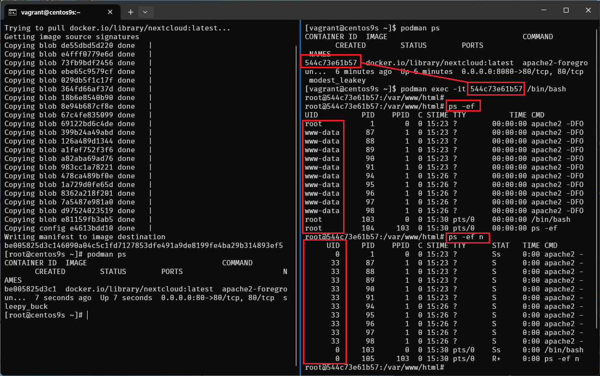

# Lab2 Container Volume

**Step-01 start vagrant up and install podman**
```
> cd podman
> vagrant up
```

Install podman like process in lab1
```
sudo dnf install podman podman-docker
```

**Step-02 Root vs Rootless**
in podman we can choose to start containre with root or rootless (unprivileged user). Example:

Run as rootless
```
$ podman run -d registry.access.redhat.com/ubi9:latest

Trying to pull registry.access.redhat.com/ubi9:latest...
Getting image source signatures
Checking if image destination supports signatures
Copying blob cc296d75b612 done   |
Copying config 159a1e6731 done   |
Writing manifest to image destination
Storing signatures
1d6ea7c49a974ffc17ebfccd3783addeec861124250df30dbce2cd38cd913b96

$ podman rm 1d6ea
```

Run podman as root
```
$ sudo su -
# podman run -d registry.access.redhat.com/ubi9:latest

Trying to pull registry.access.redhat.com/ubi9:latest...
Getting image source signatures
Checking if image destination supports signatures
Copying blob cc296d75b612 done   |
Copying config 159a1e6731 done   |
Writing manifest to image destination
Storing signatures
18b18e03e37aa8dffbbfdd3af7f352c49cae7bbf4848c56a458e3bee30e5304f

# podman rm 18b18e
```

both command create container in difference namespace event run same command

Processes that running within the container
- What account start podman on hosts?
- What is user account is running the processes within container

> **Remember** Containers have their own ```/etc/passwd``` and ```/etc/group``` files that define in container users and groups. when we build container we can choose user run the process in Container

- Many Containers run their processes as root within the container, however is not recommmended from a security perspective.

## 4 Options to run container

**Step-03 Option 1 : Container as Root**

```
[root@centos9s ~]# podman run -it ubi9:latest /bin/bash
[root@99713d1d44e1 /]# whoami
root
[root@99713d1d44e1 /]# id -u root
0
[root@99713d1d44e1 /]# exit
[root@centos9s ~]# podman rm 99713
```
- processes run as UID 0 inside container
- processes run as UID 0 outside the container from host namespace

**Step-04 Option 2 : Container as Root an assign user in container**

```
[root@centos9s ~]# podman run -it -u sync ubi9:latest /bin/bash
bash-5.1$ whoami
sync
bash-5.1$ id -u sync
5
bash-5.1$ exit
exit
```
- Start podman as root
- processes run as UID 5 (sync) inside container
- processes run as UID 0 outside the container from host

**Step-05 Option 3 : Container as user vagrant**
```
[vagrant@centos9s ~]$ whoami
vagrant
[vagrant@centos9s ~]$ podman run -it ubi9:latest /bin/bash
[root@c39466bba6bc /]# whoami
root
[root@c39466bba6bc /]# exit
exit
```
- start container as user vagrant
- process run UID 1000 (vagrant) on host perspective
- process run UID 0 root inside container
- root process in container can restart process in container but can't manage process from host
- root inside container will map to user vagrant on host

**Step-06 Option 4 : Container as user vagrant with sync user**
```
[vagrant@centos9s ~]$ podman run -it -u sync ubi9:latest /bin/bash
bash-5.1$ whoami
sync
bash-5.1$ exit
exit
```
- start container as user vagrant
- process run UID 5 (sync) in container (also non root inside container)
- process map UID 5 inside to 1000 outside
- process run UID 1000 (vagrant) on host perspective

## What is relation between maping user namespace

**Step-07 Split windows teminal to 2 span**


- boot run ```vagrant ssh``` into Vagrant box
- on Left run vagrant host command
- on Right site we run command inside container


Run monitor command on left side
```
$ sudo su -
# ps -ef | grep sleep
```

Run command on Right site
```
$ podman run -it ubi9:latest /bin/bash

# whoami
# id
# dnf install procps-ng -y
# sleep 5000 &
# sleep 5100 &
# sleep 5200 &

# ps -ef
```


- On host perspective will run as vagrant user but inside container run as root
```
vagrant     8492    8371  0 14:16 pts/0    00:00:00 /usr/bin/coreutils --coreutils-prog-shebang=sleep /usr/bin/sleep 5000
```

**Step-08 add new user in container**
- create user1
- switch user ```su -```

```
# useradd -u 2000 user1
# id user1

# su - user1

$ sleep 3000 &
$ sleep 3100 &
$ sleep 3200 &
```


- also run ```ps -ef | grep sleep```  in host terminal again also map with user vagrant

**Step-09 run ```lsns -t user```**
- list user namespace in container
```
[user1@bd29b303632f ~]$ lsns -t user
        NS TYPE  NPROCS PID USER  COMMAND
4026532167 user       5  42 user1 -bash
```

- list user namespace in host
```
[root@centos9s ~]# lsns -t user
        NS TYPE  NPROCS   PID USER    COMMAND
4026531837 user     122     1 root    /usr/lib/systemd/systemd t
4026532167 user      13  7091 vagrant catatonit -P
```


**Step-10 run ```cat /etc/subuid```**
```
[root@centos9s ~]# cat /etc/subuid
vagrant:100000:65536
```
- 1st Field :  Username or UID
- 2nd Field :  Start Subordinate UID
- 3rd Field :  Number of Subordinate UIDs

**Create some more user**
```
[root@centos9s ~]# useradd testuser1
[root@centos9s ~]# useradd testuser2
[root@centos9s ~]# useradd testuser3
[root@centos9s ~]# useradd testuser4
[root@centos9s ~]# cat /etc/subuid
vagrant:100000:65536
testuser1:165536:65536
testuser2:231072:65536
testuser3:296608:65536
testuser4:362144:65536
```


The output of cat /proc/1/uid_map shows the UID (User ID) mappings for the first process, which is typically the init or systemd process in a Linux system. This file is used in the context of user namespaces, which allow processes to have different user and group IDs inside the namespace than outside it.

Here's what each column represents:

- Column 1 (Inside UID): The starting UID inside the user namespace.
- Column 2 (Outside UID): The starting UID outside the user namespace.
- Column 3 (Range): The number of UIDs in this range.

- The first line indicates that inside the namespace, UID 0 (root) maps to UID 1000 outside the namespace. Only one UID is mapped.
- The second line indicates that UIDs starting from 1 inside the namespace map to UIDs starting from 100000 outside the namespace, with a range of 65536 UIDs.

This setup is commonly seen in containerized environments, where the root user inside the container (namespace) is not actually root on the host system but mapped to an unprivileged user (like UID 1000). This enhances security by preventing processes within the container from having root privileges on the host system.

**Step-11 How to find user mapping between inside and outside**


```
[root@bd29b303632f /]# useradd -u 5678 user2
[root@bd29b303632f /]# id user2
uid=5678(user2) gid=5678(user2) groups=5678(user2)
[root@bd29b303632f /]#
```
- create user id  5678 in container. What is user map to host?
- Range between 100000 -1 = 99999
- User map on host  5678+99999 = 105,677


**Step-12 Run monitor on host**
```
[root@centos9s ~]# su - vagrant -c "podman ps"

[vagrant@centos9s ~]$ podman ps

[vagrant@centos9s ~]$ podman top bd29b303632f user huser args
USER        HUSER       COMMAND
root        1000        /bin/bash
root        1000        /usr/bin/coreutils --coreutils-prog-shebang=sleep /usr/bin/sleep 5000
root        1000        /usr/bin/coreutils --coreutils-prog-shebang=sleep /usr/bin/sleep 5100
root        1000        /usr/bin/coreutils --coreutils-prog-shebang=sleep /usr/bin/sleep 5200
user1       101999      /usr/bin/coreutils --coreutils-prog-shebang=sleep /usr/bin/sleep 3000
user1       101999      /usr/bin/coreutils --coreutils-prog-shebang=sleep /usr/bin/sleep 3100
user1       101999      /usr/bin/coreutils --coreutils-prog-shebang=sleep /usr/bin/sleep 3200
root        1000        su - user2
user2       105677      -bash
user2       105677      /usr/bin/coreutils --coreutils-prog-shebang=sleep /usr/bin/sleep 6000

```


- Output command list process in container 
- First Colume (USER) is from container point of view
- Second Colume (HUSER) is from Host point of view


**Step-13 Limitation of Rootless container**

- run nextcloud container
- map port 80:80 

```
$ podman run -d -p 80:80 -v nextcloud_volume:/var/www/html docker.io/library/nextcloud:latest
```
- what is error mean?


- Run command again
```
$ podman run -d -p 8080:80 -v nextcloud_volume:/var/www/html docker.io/library/nextcloud:latest
```


- Enable firewalld

```
[vagrant@centos9s ~]$ sudo firewall-cmd --permanent --add-port=8080/tcp
success
[vagrant@centos9s ~]$ sudo firewall-cmd --reload
success
[vagrant@centos9s ~]$ sudo firewall-cmd --permanent --add-port=80/tcp
success
[vagrant@centos9s ~]$ sudo firewall-cmd --reload
success
[vagrant@centos9s ~]$
```


- Open browser http://192.168.33.10:8080/ 


- Next we run exec command to go inside next cloud container

```
[vagrant@centos9s ~]$ podman ps
CONTAINER ID  IMAGE                               COMMAND               CREATED        STATUS        PORTS                         NAMES
544c73e61b57  docker.io/library/nextcloud:latest  apache2-foregroun...  5 minutes ago  Up 5 minutes  0.0.0.0:8080->80/tcp, 80/tcp  modest_leakey
[vagrant@centos9s ~]$ podman exec -it 544c73e61b57 /bin/bash
root@544c73e61b57:/var/www/html# ps -ef
root@544c73e61b57:/var/www/html# ps -ef n
```
- ```ps -ef``` show username,   ```ps -ef n``` show user id name



- UID of www-data is 33 then User on host will be  33+99999  = 100032
- Check from host by run ```ps -ef n```


- On host run command ```podman volume ls```

```
[vagrant@centos9s ~]$ podman volume ls
[vagrant@centos9s ~]$ podman volume inspect nextcloud_volume
[vagrant@centos9s ~]$ ls -l /home/vagrant/.local/share/containers/storage/volumes/nextcloud_volume/_data
```


> confirm user id 100032 is owner of file on host