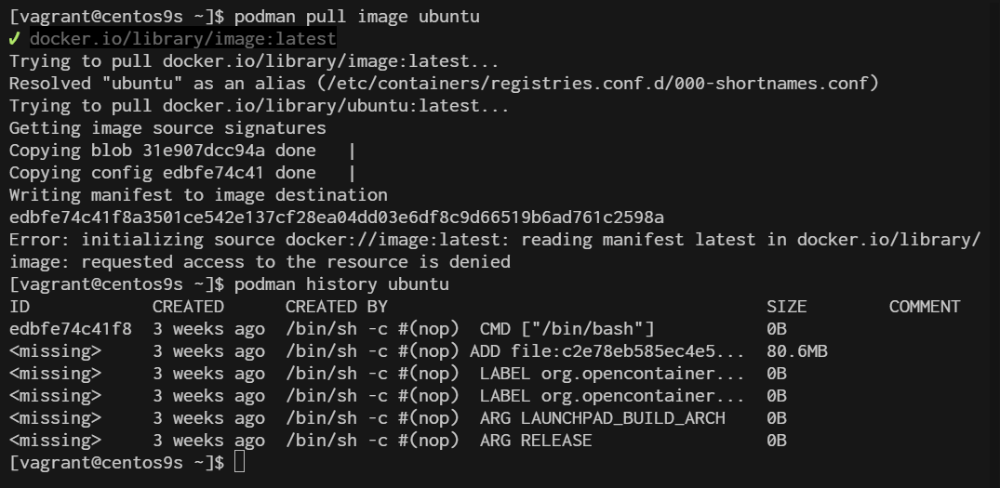
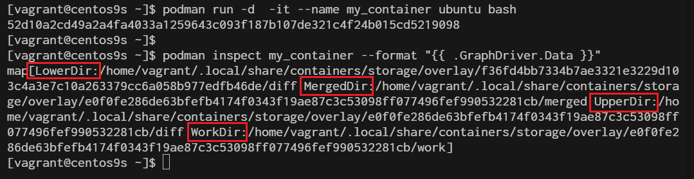
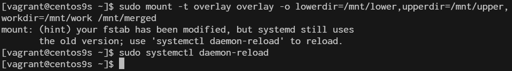

# Lab3 Container OverlayFS

OverlayFS in Podman: A Step-by-Step Tutorial

**Overview**
OverlayFS is a powerful and efficient union filesystem that allows you to layer multiple filesystems on top of each other. In the context of Podman, OverlayFS is used to manage container storage, allowing for efficient storage and management of container images and layers.

**Prerequisites**
- Basic understanding of Linux filesystems.
- Podman installed on your system.
- Root or rootless user access to Podman.

**Step 1: Understanding OverlayFS in Podman**

OverlayFS works by stacking layers on top of each other, with each layer representing a change or update. These layers are managed as follows:

- Lowerdir: The base image or read-only layers.
- Upperdir: The top writable layer where changes are made.
- Workdir: A work directory used during operations like copy-up.
- Merged: The final view that merges the lower and upper directories.

In Podman, these directories correspond to different layers in container images.

package
```
$ rpm -qa | grep fuse-overlayfs
fuse-overlayfs-1.14-1.el9.x86_64
```
**Step 2: Checking OverlayFS Support**
- Before proceeding, ensure that your kernel supports OverlayFS:
```
$ grep overlay /proc/filesystems
nodev   overlay
```

**Step 3 configuration of podman use overlay**
```
$ sudo vim /etc/containers/storage.conf
```

```
[storage]

# Default Storage Driver, Must be set for proper operation.
driver = "overlay"
```

**Step 4 Inspect Container layer with OverlayFS**

```
[vagrant@centos9s ~]$ podman pull image ubuntu
[vagrant@centos9s ~]$ podman history ubuntu
```


**Step 5 Creating and managing Containers with overlayFS**

When you create or manage containers with podman, OverlayFS automatically handles the storage layers

1. Create a new container
```
$ podman run -it --name my_container ubuntu bash
root@e1c95b5aed74:/# exit
```
2. Inspect the container's storage layers:
```
$ podman inspect my_container --format "{{ .GraphDriver.Data }}"
```
This will display details about the OverlayFS layers used by the container.




**Step 6 Manual working with practical workshop**

1 Create the required directories:

- lowerdir: This is the lower (read-only) layer.
- upperdir: This is the upper (read-write) layer.
- workdir: A directory used internally by OverlayFS.
- merged: The directory where the final merged view will be mounted.

```
$ sudo mkdir -p /mnt/lower /mnt/upper /mnt/work /mnt/merged
```

2 Ensure that the lowerdir and upperdir have content:

- You can add some files to lowerdir to simulate the lower layer.
- The upperdir should be empty initially, as it will contain changes.
Example:

```
$ echo "Lower Layer File" | sudo tee /mnt/lower/lowerfile.txt
```

3 Mount the OverlayFS:

Use the following command, replacing **/mnt/lower**, **/mnt/upper**, **/mnt/work**, and **/mnt/merged** with your actual directory paths:

```
sudo mount -t overlay overlay -o lowerdir=/mnt/lower,upperdir=/mnt/upper,workdir=/mnt/work /mnt/merged
```



4  Verify

```
$ ls /mnt/merged
lowerfile.txt
```
> Ensure all directories exist: The lowerdir, upperdir, workdir, and merged directories must exist before attempting the mount.

