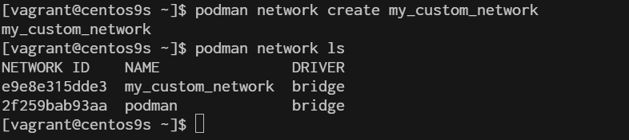
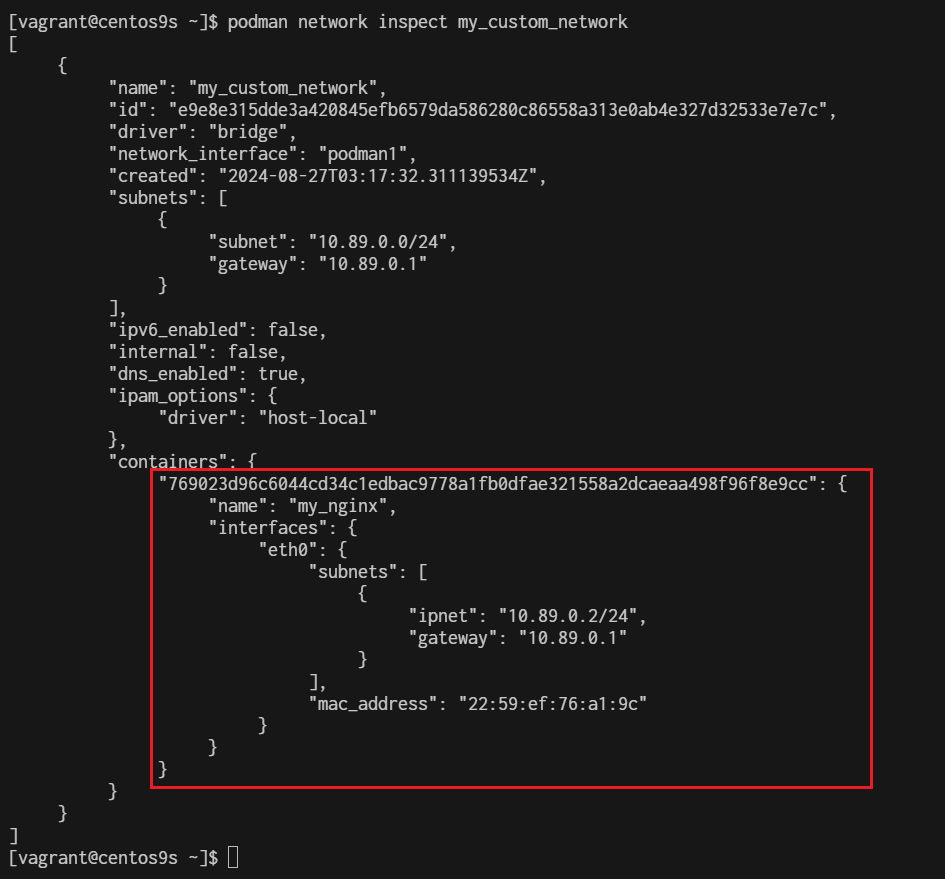
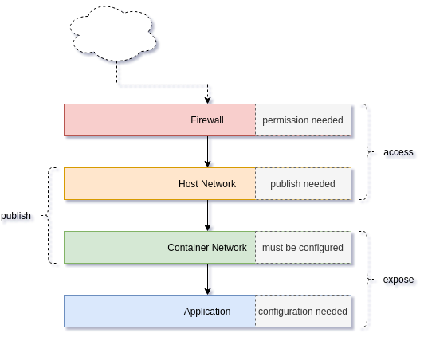
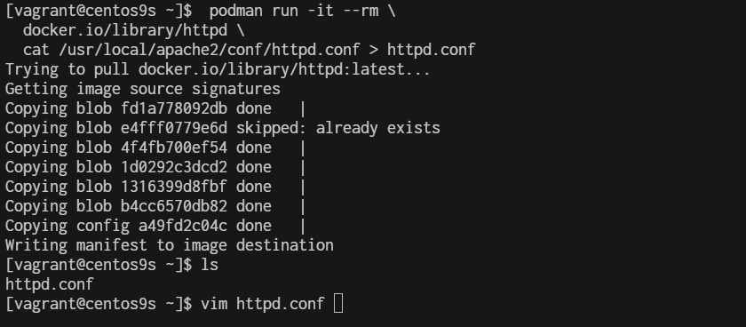
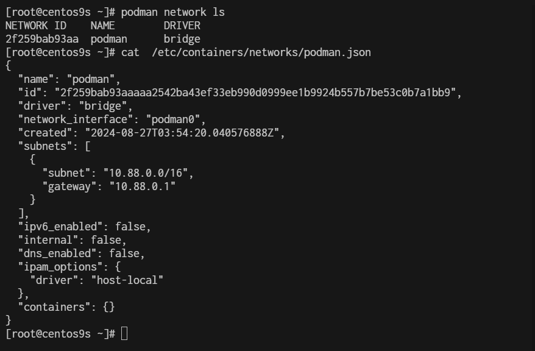
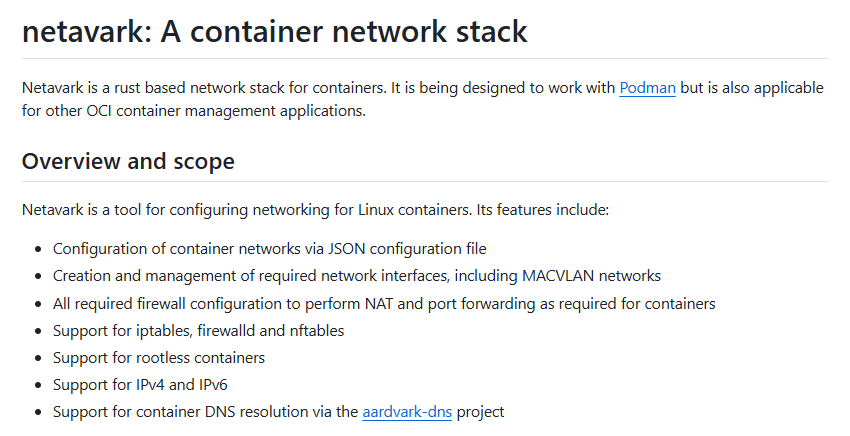
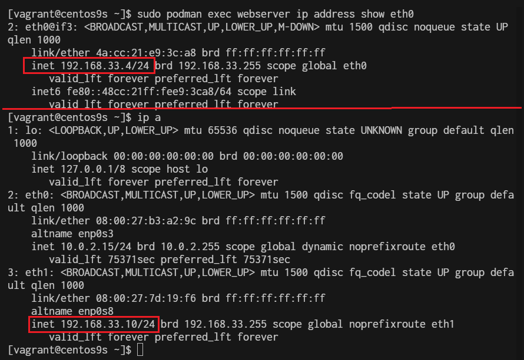

# Lab4 Container Network

Podman provides robust networking capabilities for containers, allowing you to manage how containers communicate with each other and the outside world. Here's a guide to understanding and working with Podman networks.

**1. Understanding Podman Networks**
Podman supports several types of networks:

- **Bridge (Default)**: Containers are connected to an internal bridge network that allows them to communicate with each other and the host system.
- **Host:** Containers share the host’s network namespace, meaning they use the host’s network directly.
- **None:** The container has no network interfaces.
- **Custom Networks:** You can create custom networks to provide isolated environments for containers.

**2. Listing Available Networks**
You can list all available networks using the following command:

```
$ podman network ls
NETWORK ID    NAME        DRIVER
2f259bab93aa  podman      bridge
```

**3. Create a Custom network**
You can create a custom network to provide containers with isolated or shared networking configurations.

```
$ podman network create my_custom_network
$ podman network ls
```


- create network with option subnet, gateway and ip range
```
$ podman network create --subnet 192.168.100.0/24 --gateway 192.168.100.1 my_custom_network2
$ podman network ls
```

**4. Running Container on Custom network**

```
$ podman run -d --name my_nginx --network my_custom_network nginx
769023d96c6044cd34c1edbac9778a1fb0dfae321558a2dcaeaa498f96f8e9cc

$ podman network inspect my_custom_network
```

Connect bridge nework we will use port mapping

```
$ sudo podman run -dt --name webserver -p 8080:80 quay.io/libpod/banner
```

```
$ podman network create  podman1
$ podman run -dt --name webserver --net podman1 -p 8081:80 quay.io/libpod/banner
```

```
$ curl 192.168.33.10:8080
   ___          __
  / _ \___  ___/ /_ _  ___ ____ 
 / ___/ _ \/ _  /  ' \/ _ `/ _ \
/_/   \___/\_,_/_/_/_/\_,_/_//_/
```

```
$ curl 192.168.33.10:8081
   ___          __
  / _ \___  ___/ /_ _  ___ ____
 / ___/ _ \/ _  /  ' \/ _ `/ _ \
/_/   \___/\_,_/_/_/_/\_,_/_//_/

```


**5 . Connecting and Disconnecting Containers from Networks**
- Connect
```
$ podman network connect my_custom_network  my_nginx
```

- Disconnect
```
$ podman network disconnect my_custom_network my_nginx
```

- Delete network
```
$ podman network rm my_custom_network
```

## Network Layer


**7. Extract Application network configuration**
The first artifact of the network is the application. Almost all applications can listen to defined addresses and/or defined ports. By checking the Apache httpd config file, we can see what's happening.

```
$  podman run -it --rm \
  docker.io/library/httpd \
  cat /usr/local/apache2/conf/httpd.conf > httpd.conf

$ vim httpd.conf
```


```
 50 #
 51 #Listen 12.34.56.78:80
 52 Listen 80
 53 
 54 #
```

8. Check network
- Rootfull
```
[root@centos9s ~]# podman network ls
NETWORK ID    NAME        DRIVER
2f259bab93aa  podman      bridge
[root@centos9s ~]# cat  /etc/containers/networks/podman.json
```


- Rootless
```
[vagrant@centos9s ~]$ podman network inspect podman
[
     {
          "name": "podman",
          "id": "2f259bab93aaaaa2542ba43ef33eb990d0999ee1b9924b557b7be53c0b7a1bb9",
          "driver": "bridge",
          "network_interface": "podman0",
          "created": "2024-08-27T03:59:17.405621928Z",
          "subnets": [
               {
                    "subnet": "10.88.0.0/16",
                    "gateway": "10.88.0.1"
               }
          ],
          "ipv6_enabled": false,
          "internal": false,
          "dns_enabled": false,
          "ipam_options": {
               "driver": "host-local"
          },
          "containers": {}
     }
]
```


By default, rootful and rootless containers use the netavark for its default network

```
[vagrant@centos9s ~]$ rpm -qa | grep netavark
netavark-1.12.1-1.el9.x86_64
```
[https://github.com/containers/netavark](https://github.com/containers/netavark)




## Macvlan  Network

With macvlan, the container is given access to a physical network interface on the host. This interface can configure multiple subinterfaces. And each subinterface is capable of having its own MAC and IP address. In the case of Podman containers, the container will present itself as if it is on the same network as the host. outside clients will be able to access the web container by its IP address directly

- Create macvlan network
```
$ sudo podman network create -d macvlan -o parent=eth1 webnetwork
```

- list network
```
$ sudo podman network ls
NETWORK ID    NAME        DRIVER
2f259bab93aa  podman      bridge
01a566095b49  webnetwork  macvlan
```

- Start dhcp
```
sudo systemctl enable --now netavark-dhcp-proxy.socket
```

- Start run container
```
$ sudo podman run -dt --name webserver --network webnetwork quay.io/libpod/banner 
```

- Check ip address inside container
```
$ sudo podman exec webserver ip address show eth0
```
